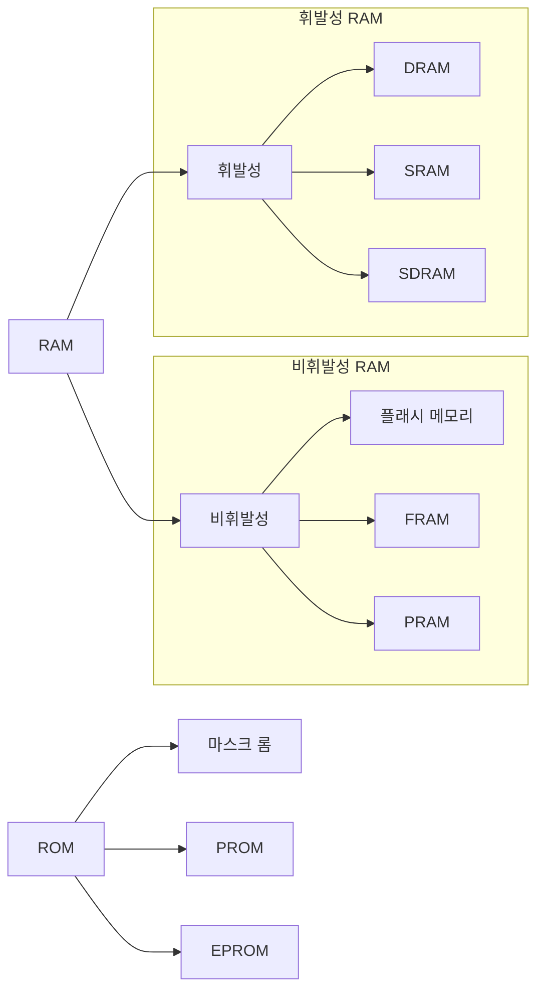

# 운영체제와 컴퓨터

## 요약

- 운영체제의 정의
    - 컴퓨터 자원을 효율적으로 관리하는 소프트웨어를 운영체제 혹은 OS라 부른다
    - 운영체제는 사용자에게 인터페이스를 제공하고 응용 프로그램에 컴퓨터 자원을 골고루 배분하여 작업 환경을 만들어 준다
    - 적당한 시점에 응용 프로그램으로부터 자원을 회수하고 악의적인 응용 프로그램으로부터 컴퓨터를 보호한다
- 운영체제의 역활과 목표
    - 컴퓨터 자원을 관리하는 운영체제의 역할은 자원 관리, 자원 보호, 하드웨어 인터페이스 제공, 사용자 인터페이스 제공이다
    - 운영체제는 이러한 역할을 제대로 수행하여 효율성, 안정성, 확장성, 편리성을 강화할 수 있는 형태로 발전해 왔다
- 운영체제의 구성
    - 운영체제의 핵심 기능을 모아놓은 것을 커널이라고 하며 커널에 명령을 내리고 그 결과를 알려주는 것을 사용자 인터페이스라고 한다
    - 커널과 하드웨어의 인터페이스는 디바이스 드라이버라고 한다
- 운영체제의 역사
    1. 작업 방식의 발전
        - 한 번에 하나의 프로그램만 실행할 수 있는 일괄 작업 시스템(또는 일괄 처리 시스템)에서, 키보드와 모니터가 발명되자 대화형 시스템이 가능해졌다
        - 이후 CPU 시간을 잘게 나누어 여러 프로그램을 동시에 실행하는 시스템인 시분할 시스템이 등장하였다
        - 시분할 시스템으로 다중 사용자 시스템이 만들어졌고 이때 만들어진 운영체제가 유닉스다
    2. 컴퓨팅 환경의 발전
        - 네트워크상에 분산된 여러 컴퓨터로 작업을 처리하고 그 결과를 상호 교환하도록 구성한 것이 분산 시스템이다
        - 이것이 발전하여 언제 어디서나 컴퓨팅 파워와 소프트웨어에 접근할 수 있는 유연한 컴퓨터 환경을 제공하는 클라우드 시스템이 개발되었다
- 시스템 호출과 API, SDK
    1. 시스템 호출
        - 커널은 컴퓨터 자원을 사용할 수 있도록 다양한 (시스템) 함수를 제공하는데, 사용자가 자발적으로 커널에 진입할 수 있는 유일한 방법은 시스템 호출뿐이다
    2. API
        - 응용 프로그램이 자신과 연관된 프로그램을 만들 수 있도록 제공하는 인터페이스다
    3. SDK
        - 프로그램 개발자를 우ㅣgo API, 코드 편집기, 에뮬레이터 같은 각종 개발용 응용 프로그램까지 하나로 묶어서 배포하는 개발 툴이다
- 커널의 종류
    1. 단일형 구조 커널
        - 핵심 기능을 구현하는 모듈들이 구분 없이 하나로 구성된 커널이다
    2. 계층형 구조 커널
        - 비슷한 기능을 가진 모듈을 묶어서 하나의 게층으로 만들고, 계층 간의 통신을 통해 운영체제를 구현하는 방식의 커널이다
    3. 마이크로 구조 커널
        - 프로세스 관리, 메모리 관리, 프로세스 간 통신 관리 등 가장 기본 기능만 제공하는 커널이다
- 폰노이만 구조
    - 폰노이만 구조의 특징은 모든 프로그램은 메모리에 올라와야 실행할 수 있다는 것이다
- 버스와 레지스터
    - 메인보드의 시스템 버스를 FSB, CPU 내부버스를 BSB라고 한다
    - 시스템 버스는 제어 버스, 주소 버스, 데이터 버스로 구성되며 이 중 단방향 버스는 주소 버스다
    - 제어 버스는 제어장치, 주소 버스는 MAR, 데이터 버스는 MBR과 연결된다
- CPU와 레지스터
    - CPU의 구성 요소는 산술논리 연산장치, 레지스터, 제어장치다
    - 다음 실행할 주소를 가진 레지스터는 PC이며, 현재 실행 중인 명령어를 저장한 레지스터는 IR이다
    - 데이터를 가져오거나 반대로 메모리로 데이터를 보낼 떄 주소를 지정하기 위해 사용하는 레지스터는 MAR이며, 메모리에서 가져온 데이터나 메모리로 옮겨 갈 데이터를 임시로 저장하는 레지스터는 MBR이다
- 컴퓨터 성능 향상 기술
    1. 버퍼
        - 속도 차이가 있는 두 장치 사이에서 그 차이를 완화하는 역할을 한다
        - 입출력장치가 독립적으로 동작호도록 고안된 소프트웨어적인 버퍼를 스풀이라고 한다
        - 버퍼 중에서 앞으로 사용할 것을 미리 가져와 속도를 향상하는 장치를 캐시라고 한다
        - 캐시에 원하는 데이터가 있는 경우 캐시 히트, 원하는 데이터가 없는 경우 캐시 미스라고 한다
    2. 저장장치의 계층 구조
        - CPU 가까이 고속의 메모리를 배치하는 방법이다
        - 적당한 가격으로 빠른 속도와 큰 용량을 동시에 얻을 수 있다
    3. 인터럽트 방식
        - CPU 작업과 입출력 작업을 분리하여 효율을 높이는 방식이다
        - CPU는 입출력 관리자에게 작업을 지시하고, 입출력 관리자는 입출력이 끝나면 CPU에 인터럽트를 보낸다
    4. 직접 메모리 접근
        - 입출력 관리자에게 CPU의 허락 없이 메모리에 접근할 수 있게 권한을 주는 것을 직접 메모리 접근 이라고 한다
    5. 메모리 맵 입출력
        - 메모리의 일정 공간을 입출력에 할당하여 CPU가 사용하는 데이터와 입출력장치가 사용하는 데이터가 섞이지 않게 관리하는 기법이다
    6. 사이클 훔치기
        - 메모리에 동시에 접근했을 때 CPU가 메모리 사용 권한을 장치 관리자에게 양보하는 것이다
- 멀티 프로세싱
    - 최신 CPU는 멀티코어와 병렬 처리 기법을 사용하여 CPU 성능을 높인다
    - 멀티코어 시스템에서는 하나의 칩에 CPU의 핵심이 되는 코어를 여러 개 만들어 여러 작업을 동시에 처리할 수 있다
    - 하나의 코어에서 여러 개의 스레드를 동시에 처리하는 방법을 CPU 멀티스레드라고 한다

---

## 목차

- [운영체제의 개요](#운영체제의-개요)
    - [운영체제란](#운영체제operating-system란)
        - [컴퓨터 구조와 운영체제](#컴퓨터-구조와-운영체제)
        - [운영체제의 역할](#운영체제의-역할)
    - [운영체제의 발전](#운영체제의-발전)
        - [초창기 컴퓨터](#초창기-컴퓨터)
        - [일괄 처리 시스템](#일괄-처리-시스템)
        - [대화형 시스템](#대화형-시스템)
        - [시분할 시스템](#시분할-시스템)
        - [실시간 시스템](#실시간-시스템)
        - [분산 시스템](#분산-시스템)
        - [클라이언트/서버 시스템](#클라이언트서버-시스템)
        - [P2P 시스템 (peer-to-peer system)](#p2p-시스템-peer-to-peer-system)
        - [클라우드 컴퓨팅](#클라우드-컴퓨팅)
        - [사물 인터넷](#사물-인터넷)
    - [운영체제의 구성](#운영체제의-구성)
        - [커널과 인터페이스](#커널과-인터페이스)
        - [시스템 호출과 디바이스 드라이버](#시스템-호출과-디바이스-드라이버)
        - [커널의 역할과 종류](#커널의-역할과-종류)
        - [가상머신](#가상머신)
- [컴퓨터의 구조와 성능 향상](#컴퓨터의-구조와-성능-향상)
    - [컴퓨터의 기본 구성](#컴퓨터의-기본-구성)
        - [하드웨어의 구성](#하드웨어의-구성)
        - [폰노이만 구조](#폰노이만-구조)
        - [요리사 모형](#요리사-모형)
        - [기초 용어 정리](#기초-용어-정리)
    - [CPU와 메모리](#CPU와-메모리)
        - [CPU의 구성과 동작](#CPU의-구성과-동작)
        - [메모리의 종류와 부팅](#메모리의-종류와-부팅)
    - [컴퓨터 성능 향상 기술](#컴퓨터-성능-향상-기술)
        - [버퍼](#버퍼)
        - [저장장치의 계층 구조](#저장장치의-계층-구조)
        - [인터럽트](#인터럽트)
        - [직접 메모리 접근](#직접-메모리-접근)
        - [메모리 맵 입출력](#메모리-맵-입출력)
        - [사이클 훔치기](#사이클-훔치기)
    - [멀티 프로세싱](#멀티-프로세싱)
        - [멀티코어 시스템](#멀티코어-시스템)
        - [CPU 멀티스레드](#CPU-멀티스레드)

---

## 운영체제의 개요

### 운영체제(Operating system)란?

- 운용체제는 응용 프로그램의 잘못된 동작으로 컴퓨터가 망가지는 것을 막기 위해 컴퓨터 전체를 관리하고 운영하는 소프트웨어이다

#### 컴퓨터 구조와 운영체제

- 컴퓨터는 하드웨어와 소프트웨어로 구성되어 있다
- 하드웨어는 컴퓨터를 구성하는 기계적인 장치이고, 소프트웨어는 하드웨어를 제어하는 명령어 집합이다
- 운영체제는 커널(kernel)과 인터페이스로 나뉜다
- 커널은 하드웨어를 직접 제어하는 운영체제의 핵심 기능들을 모아놓은 것이다
- 인터페이스는 사용자와 커널 사이의 통신을 담당한다

#### 운영체제의 역할

1. 자원 관리
    - 컴퓨터 시스템의 자원을 효율적으로 관리한다
    - 자원은 CPU, 메모리, 입출력 장치 등이 있다
2. 자원 보호
    - 컴퓨터 시스템의 자원을 보호한다
    - 자원을 사용하는 응용 프로그램이 다른 응용 프로그램의 자원을 침범하지 못하도록 보호한다
3. 하드웨어 인터페이스 제공
    - 응용 프로그램이 하드웨어를 직접 제어하는 것을 막고, 운영체제를 통해 하드웨어를 제어하도록 한다
    - 응용 프로그램은 운영체제가 제공하는 인터페이스를 통해 하드웨어를 제어한다
4. 사용자 인터페이스 제공

#### 운영체제의 목표

1. 효율성
    - 컴퓨터 시스템의 자원을 효율적으로 관리한다
2. 안정성
    - 컴퓨터 시스템의 자원을 보호한다
    - 응용 프로그램의 잘못된 동작으로 컴퓨터 시스템이 망가지는 것을 막는다
    - 하드웨어적인 보안 문제를 해결한다
    - 시스템에 문제가 발생했을 때 이전으로 복구하는 결함 포용 기능(fault tolerant)을 수행해야 한다
3. 확장성
    - 컴퓨터 시스템의 자원을 쉽게 추가할 수 있도록 설계한다
4. 편리성
    - 사용자가 컴퓨터 시스템을 쉽게 사용할 수 있도록 설계한다
    - 사용자가 컴퓨터 시스템을 쉽게 사용할 수 있도록 사용자 인터페이스를 제공한다

---

### 운영체제의 발전

- 운영체제는 컴퓨터의 발전과 함께 발전해왔다

_운영체제의 역사 (주변장치 기반)_

|    시기     |     주요기술     |                         특징                          |
|:---------:|:------------:|:---------------------------------------------------:|
|  1940년대   |      없음      |                   - 진공관(0과 1) 사용                    |
|  1950년대   | 카드리더, 라인 프린터 |             - 일괄 작업 시스템  - 운영체제의 등장             |
| 1960년대 초반 |   키보드, 모니터   |                      - 대화형 시스템                      |
| 1960년대 후반 |     C 언어     |           - 멀티프로그래밍 기술 개발  - 시분할 시스템            |
|  1970년대   |      PC      |             - 개인용 컴퓨터의 등장  - 분산 시스템             |
|  1990년대   |      웹       |                   - 클라이언트/서버 시스템                    |
|  2000년대   |     스마트폰     | - P2P 시스템(메신저, 파일 공유)  - 클라우드 컴퓨팅  - 사물 인터넷 |

#### 초창기 컴퓨터

- 최초의 컴퓨터인 에니악은 전선을 잭에 꽃아 회로를 연결하여 구성한 30톤 규모의 거대한 계산기로 미사일 탄도를 계산하기 위해 제작되었다
- 백열전구 같은 모양의 진공관을이라는 소자를 사용하여 진공관이 켜지면 1, 꺼지면 0이라고 판단했다
    - 이는 컴퓨터가 2진법을 사용하는 계기가 되었다
- 이렇게 전선을 연결하여 논리회로를 구성하는 것을 하드와이어링(hard wiring)방식 이라고 한다
- 초창기의 컴퓨터에는 운영체제가 없었다

#### 일괄 처리 시스템

- 진공관을 전선으로 연결했던 초창기의 컴퓨터는 기술 발전을 거쳐 IC(Integrated Circuit)라는 칩으로 만들어졌다.
    - 이 칩은 진공관과 전선으로 만들어진 논리회로를 아주 작은 크기로 구현한 것이다
    - IC 칩을 이용함으로써 현대적인 모습의 컴퓨터가 탄생하였다
- 미약하지만 중앙처리장치인 CPU(Central Processing Unit)와 메인메모리가 있었다
    - 키보드와 같은 입력장치, 모니터와 같은 출력장치는 없었다
    - 대신 천공카드 리더(punch card reader)를 입력장치로, 라인 프린터(line printer)를 출력장치로 사용하였다
- 천공카드 시스템에서는 천공카드 리더로 하나의 작업을 읽어들여 실행하고 결과를 출력한 후 다음 작업을 읽어들여 실행한다.
    - 따라서 필요한 프로그램과 데이터를 동시에 입력해야 작업이 가능했다
    - 지금의 프로그래밍 환경과 달리 모든 작업을 한꺼번에 처리해야 하고 프로그램 실행 중간에 사용자가 데이터를 입력하거나 수정하는 것이 불가능했다
- 이러한 방식을 일괄 작업 시스템(batch job system) 또는 일괄 처리 시스템(batch processing system)이라고 한다
- 일괄 처리 시스템에서는 단순 계산 위주의 작업만 가능했다

_일괄 작업 시스템 입출력 장치_

|      장치       |                                  설명                                  |
|:-------------:|:--------------------------------------------------------------------:|
| 천공카드 리더(입력장치) | 카드에 구멍을 뚫어 문자를 입력하는 천공카드 리더는 OMR(Optical Mark Reader)의 원조 격이라 할 수 있다 |
| 라인 프린터(출력장치)  |           문자만 출력하는 프린터로 한 번에 한 줄씩 출력하기 때문에 라인프린터라는 이름이 붙었다           |

#### 대화형 시스템

- 1960년대 초반에는 키보드와 모니터가 등장하였다
    - 기존 일괄 작업 시스템은 프로그램과 데이터를 같이 입력하여 작업의 최종 결과만 얻을 수 있었다
    - 그러나 키보드와 모니터가 개발됨으로써 작업 중간에 사용자가 입력을 하거나 사용자에게 중간 결과 값을 보여줄 수 있게 되었다
- 이처럼 컴퓨터와 사용자의 대화를 통해 작업이 이루어지는 시스템을 대화형 시스템(Interactive System)이라고 한다
- 대화형 시스템이 등장하면서 문서 편집기, 게임과 같은 다양한 종류의 응용 프로그램을 만들 수 있게되었다

#### 시분할 시스템

- 1960년대 후반에 컴퓨터는 크기가 작아지고 계산 능력이 향상되었다
    - 하지만 컴퓨터는 여전히 하나의 작업만 수행할 수 있어 낭비 요소가 컸다
- 이러한 인식을 바탕으로 멀티프로그래밍(multiprogramming) 기술이 개발되었다
    - 멀티프로그래밍은 하나의 CPU로 여러 작업을 동시에 실행하는 기술이다
    - 한 번에 한가지 작업만 가능한 일괄 작업 시스템에 비해 효울성이 뛰어나다
- 시분할 시스템이란 여러 작업을 조금씩 처리하여 작업이 동시에 이루어지는 것처럼 보이게 하는 것을 말한다
    - 시분할 시스템에서 동시에 실행되는 작업의 개수를 멀티프로그래밍 수준(level of multiprogramming) 또는 멀티프로그램이 정도(degree of multiprogramming)라고 한다
- 시분할 시스템에서 잘게 나뉜 시간 한 조각을 타임 슬라이스(time slice)또는 타임 퀀텀(time quantum)이라고 한다
- 시분할 시스템의 단점
    - 여러 작업을 동시에 처리하기 위한 추가 작업이 필요하다
    - 일괄 작업 시스템에서 메모리의 사용자 영역에는 프로그램이 하나뿐이지만 시분할 시스템에는 여러개의 프로그램이 공존하여 메모리를 정리하는 추가 작업이 필요하다
    - 시스탬 내에 많은 양의 작업이 공존할 경우, 중요한 작업이 일정 시간 안에 끝나는 것을 보장하지 못한다

> **멀티프로그래밍의 동작 방식**
>
> 멀티프로그래밍은 시간 분할 방법을 사용하여 CPU 사용 시간을 아주 잘게 쪼개어 여러 작업을 나누어 실행한다
>
> > 1. CPU가 작업 A를 실행한다
> > 2. 작업 A가 입출력을 요청하면 CPU는 작업 A를 중단하고 입출력을 처리한다
> > 3. 입출력이 완료되면 CPU는 작업 A를 다시 실행한다
> > 4. 작업 A가 다시 입출력을 요청하면 CPU는 작업 A를 중단하고 입출력을 처리한다
> > 5. 이러한 과정을 반복한다
>
> **오늘날의 컴퓨터에서는 대부분 시분할 시스템이 사용된다**

#### 실시간 시스템

- 특정 시슽메에서 일정 시간 안에 작업이 처리되도록 보장하는 시스템이다
- 실시간 시스템의 종류
    1. 경성 실시간 시스템 (hard real-time system)
        - 지정한 응답 시간을 정확히 지키는 시스템
        - 예) 미사일 제어 시스템, 핵발전소 제어 시스템
    2. 연성 실시간 시스템 (soft real-time system)
        - 지정한 응답 시간을 최대한 지키지만 어느 정도 융통성이 허용된 시스템
        - 예) 멀티미디어 시스템

#### 분산 시스템

- 분산 시스템은 네트워크상에 분산된 여러 컴퓨터로 작업을 처리하고 그 결과를 상호 교환하도록 구성한 시스템이다
- 분산 시스템의 장점
    - 자원 공유
        - 분산 시스템은 여러 대의 컴퓨터가 연결되어 하나의 컴퓨터처럼 동작하기 때문에 자원을 공유할 수 있다
        - 예) 프린터, 파일, 데이터베이스 등
    - 계산 속도 향상
        - 분산 시스템은 여러 대의 컴퓨터가 연결되어 하나의 컴퓨터처럼 동작하기 때문에 계산 속도가 향상된다
        - 예) 대용량 데이터 처리, 병렬 처리 등
    - 신뢰성 향상
        - 분산 시스템은 여러 대의 컴퓨터가 연결되어 하나의 컴퓨터처럼 동작하기 때문에 하나의 컴퓨터가 고장나도 다른 컴퓨터가 작업을 처리할 수 있다
        - 예) 고장난 컴퓨터를 제외하고 작업을 처리할 수 있다
- 분산 시스템의 단점
    - 설계와 구현이 어렵다
        - 분산 시스템은 여러 대의 컴퓨터가 연결되어 하나의 컴퓨터처럼 동작하기 때문에 설계와 구현이 어렵다
        - 예) 네트워크, 보안 등
    - 디버깅이 어렵다
        - 분산 시스템은 여러 대의 컴퓨터가 연결되어 하나의 컴퓨터처럼 동작하기 때문에 디버깅이 어렵다
        - 예) 오류가 발생한 컴퓨터를 찾기 어렵다
    - 성능 저하
        - 분산 시스템은 여러 대의 컴퓨터가 연결되어 하나의 컴퓨터처럼 동작하기 때문에 성능 저하가 발생한다
        - 예) 네트워크 트래픽, 데이터 전송 등

#### 클라이언트/서버 시스템

- 클라이언트/서버 시스템은 서버가 클라이언트의 요청에 따라 서비스를 제공하는 시스템이다
- 클라이언트/서버 시스템의 장점
    - 신뢰성 향상
        - 클라이언트/서버 시스템은 서버가 클라이언트의 요청에 따라 서비스를 제공하기 때문에 하나의 서버가 고장나도 다른 서버가 작업을 처리할 수 있다
        - 예) 고장난 서버를 제외하고 작업을 처리할 수 있다
- 클라이언트/서버 시스템의 단점
    - 성능 저하
        - 클라이언트/서버 시스템은 서버가 클라이언트의 요청에 따라 서비스를 제공하기 때문에 성능 저하가 발생한다
        - 예) 네트워크 트래픽, 데이터 전송 등

#### P2P 시스템 (peer-to-peer system)

- P2P 시스템은 파일을 얻고자 하는 말단 사용자(peer)가 파일을 가진 말단 사용자로부터 직접 다운로드하는 시스템이다

#### 클라우드 컴퓨팅

- 그리드 컴퓨팅 (grid computing)
    - 네트워크 기술이 지금처럼 발전하기 전에 분산 시스템은 특정 영역에서만 사용되다가 그리드 컴퓨팅으로 발전하였다
    - 그리드 컴퓨팅은 여러 곳에 떨어진 컴퓨팅 파워나 소프트웨어을 하나로 묶어 하나의 컴퓨터처럼 사용하는 기술이다
- 클라우드 컴퓨팅 (cloud computing)
    - 하드웨어와 소프트웨어를 클라우드라고 불리는 중앙 시스템에 숨기고 사용자는 필요한 서비스만 그때그때 이용하는 방식의 컴퓨팅 환경을 클라우드 컴퓨팅이라고 한다
- 그리드 컴퓨팅과 클라우드 컴퓨팅 차이
    - 그리드 컴퓨팅은 여러 대의 컴퓨터를 하나의 컴퓨터처럼 사용하는 기술이고, 클라우드 컴퓨팅은 하드웨어와 소프트웨어를 클라우드라고 불리는 중앙 시스템에 숨기고 사용자는 필요한 서비스만 그때그때 이용하는 방식의
      컴퓨팅 환경이다

#### 사물 인터넷

- 사물 인터넷은 사물에 센서와 통신 기능을 내장하여 인터넷에 연결하는 기술이다

---

### 운영체제의 구성

#### 커널과 인터페이스

- 운영체제는 커널과 인터페이스로 구성되어 있다
- 커널(kernel)이란
    - 커널은 프로세스 관리, 메모리 관리, 저장장치 관리와 같은 운영체제의 핵심 기능을 구현한 프로그램이다
    - 운영체제의 성능은 커널이 좌우한다
- 인터페이스(interface)란
    - 인터페이스는 사용자와 응용 프로그램에 인접하여 커널에 명령을 전달하고 실행 결과를 사용자와 응용 프로그램에 돌려준다

#### 시스템 호출과 디바이스 드라이버

- 시스템 호출(system call)이란
    - 시스템 호출은 커널이 제공하는 시스템 자원을 사용하기 위한 함수다
    - 응용 프로그램이 하드웨어 자원에 접근하거나 운영체제가 제공하는 서비스를 이용하려면 시스템 호출을 사용해야 한다
    - 시스템 호출과 유사한 용어로 응용 프로그램 인터페이스(API, Application Programming Interface)와 시스템 개발자용 키트(SDK, System Developer`s Kit)가
      있다
        - API 예) Win32 API, POSIX API
        - SDK 예) Windows SDK, Android SDK
- 디바이스 드라이버(device driver)란
    - 커널과 화드웨어의 인터페이스를 디바이스 드라이버 또는 드라이버라고 부른다
    - 현대의 운영체제에서 커널은 주변장치와 데이터를 주고받는 표준 방식을 정하고 있고 표준을 따르는 주변장치는 컴퓨터에 꽂기만 하면 바로 사용할 수 있다
    - 성능 향상이나 편리성을 위하여 표준외의 기능을 수행하는 경우에는 장치 제작자가 디바이스 드라이버를 따로 준비하고 사용자가 직접 디바이스 드라이버 소프트웨어를 설치해야 주변장치를 온전히 활용할 수 있다
    - 디바이스 드라이버를 추가로 설치해야 하는 대표적인 주변장치로 그래픽 카드와 프린터가 있다

#### 커널의 역할과 종류

- 커널의 역할
    1. 프로세스 관리: 프로세스에 CPU를 배분하고 작업에 필요한 제반 환경을 제공한다
    2. 메모리 관리: 프로세스에 작업 공간을 배치하고 실제 메모리보다 큰 가상공간을 제공한다
    3. 파일 시스템 관리: 데이터를 저장하고 접근할 수 있는 인터페이스를 제공한다
    4. 입출력 관리: 필요한 입력과 출력 서비스를 제공한다
    5. 프로세스 간 통신 관리: 공동 작업을 위한 각 프로세스 간 통신 환경을 지원한다
- 커널의 종류
    - 커널의 핵심 기능은 유기적으로 복잡하게 얽혀 있어 기능을 어떻게 구현하는가에 따라 단일형 구조 커널, 계층형 구조 커널, 마이크로 구조 커널로 구분된다

    1. 단일형 구조(monolithic architecture) 커널
        - 단일형 구조 커널은 초창기 운영체제의 구조로, 커널의 핵심 기능을 구현하는 모듈이 구분 없이 하나로 구성되어 있다
        - 단일형 구조에 속하는 대표적인 운영체제는 MS-ODS, VMS, 초기의 유닉스 운영체제 이다
        - 장점
            1. 모듈이 거의 분리되지 않아 모듈 간의 통신 비용이 줄어들어 효율적인 운영이 가능하다
        - 단점
            1. 모든 모듈이 하나로 묶여 있어 버그나 오류를 처리하기 어렵다
            2. 여러 기능이 서로 연결되어 상호 의존성이 높기 때문에 작은 기능상의 결함이 시스템 전체로 확산될 수 있다
            3. 다양한 환경의 시스템에 적용하기 어렵다
        - 
    2. 계층형 구조(layered architecture) 커널
        - 계층형 구조 커널은 비슷한 기능을 가진 모듈을 묶어서 하나의 계층으로 만들고 계층 간의 통신을 통해 운영체제를 구현하는 방식이다
        - 마이크로소프트의 윈도우를 비롯해 오늘날의 운영체제는 대부분 계층형 구조로 이루어져 있다
        - 장점
            1. 비슷한 기능을 모아 모듈화했기 때문에 단일형 구조보다 버그나 오류를 쉽게 처리할 수 있다
        - 
    3. 마이크로 구조(micro architecture) 커널
        - 계층형 구조 커널 소스가 방대해짐에 따라 오류를 잡기도 어려워졌다. 이러한 문제를 해결하기 위해 계층형 구조의 접근 방식과 반대되는 접근 방식으로 개발된 것이 마이크로 구조 커널이다
        - 마이크로 구조 커널의 운영체제는 프로세스 관리, 메모리 관리, 프로세스 간 통신 관리 등 가장 기본적인 기능만 제공한다
        - 장점
            1. 마이크로 구조 커널에서 각 모듈은 독립적으로 작동하기 떄문에 하나의 모듈이 실패하더라도 전체 운영체제가 멈추지 않는다.
            2. 커널을 이식하기 쉽고 가벼워서 CPU 용량이 작은 시스템에도 적용할 수 있다.
        - 마이크로 구조 커널을 사용하는 대표적인 운영체제인
          마하([Mach](https://developer.apple.com/library/archive/documentation/Darwin/Conceptual/KernelProgramming/Mach/Mach.html))
          는 애플의 PC 운영체제인 OS X와 모바일 운영체제인 iOS의 커널로 사용되며 유명해졌다
        - 

#### 가상머신

- 가상머신(virtual machine)이란
    - 가상머신은 하나의 컴퓨터에서 여러 운영체제를 동시에 실행할 수 있도록 하는 소프트웨어다

## 컴퓨터의 구조와 성능 향상

### 컴퓨터의 기본 구성

#### 하드웨어의 구성

- 컴퓨터는 중앙처리장치(CPU), 메인메모리, 입력장치, 출력장치, 저장장치로 구성된다
- 중앙처리장치(CPU, Central Processing Unit)란
    - 중앙처리장치는 컴퓨터의 두뇌로 컴퓨터의 모든 연산을 담당한다
    - 중앙처리장치는 연산장치(ALU, Arithmetic Logic Unit)와 제어장치(CU, Control Unit)로 구성되어 있다
    - 연산장치는 산술 연산과 논리 연산을 수행한다
    - 제어장치는 명령어를 해석하고 실행하는 제어 신호를 발생시킨다
- 메인메모리란
    - 메인메모리는 중앙처리장치가 처리할 프로그램과 데이터를 저장하는 장치다
    - 메인메모리는 RAM(Random Access Memory)과 ROM(Read Only Memory)으로 구성되어 있다
    - RAM은 읽기와 쓰기가 모두 가능한 반면 ROM은 읽기만 가능하다
    - RAM은 전원이 공급되는 동안에만 데이터를 저장할 수 있지만 ROM은 전원이 공급되지 않아도 데이터를 저장할 수 있다
- 입력장치란
    - 입력장치는 사용자가 컴퓨터에 데이터를 입력하는 장치다
    - 입력장치에는 키보드, 마우스, 스캐너, 마이크 등이 있다
- 출력장치란
    - 출력장치는 컴퓨터가 처리한 결과를 사용자에게 보여주는 장치다
    - 출력장치에는 모니터, 프린터, 스피커 등이 있다
- 저장장치란
    - 저장장치는 컴퓨터가 처리한 결과를 저장하는 장치다
    - 저장장치에는 하드디스크, CD-ROM, USB 메모리 등이 있다

#### 폰노이만 구조

- 현대의 컴퓨터는 대부분 폰노이만 구조를 따른다
- 폰노이만 구조(von Neumann architecture)란
    - 중앙처리장치, 메인메모리, 입력장치, 출력장치, 저장장치가 버스로 연결된 구조를 말한다
    - 모든 프로그램은 메인메모리에 올라와야 하고 중앙처리장치는 메인메모리에 올라와있는 프로그램을 실행한다
- 버스(bus)란
    - 버스는 컴퓨터의 구성 요소들이 데이터를 주고받는 통로다
    - 버스는 데이터 버스, 주소 버스, 제어 버스로 구성되어 있다
    - 데이터 버스는 데이터를 전송하는 통로다
    - 주소 버스는 데이터가 저장된 메모리 주소를 전송하는 통로다
    - 제어 버스는 데이터 버스와 주소 버스를 제어하는 통로다
- 폰노이만 구조가 등장하기 전과 후의 차이
    - 폰노이만 구조가 등장하기 전의 컴퓨터는 전선을 연결하여 회로를 구성하는 하드와이어링 형태 였기 떄문에 다른 용도로 사용하려면 전선의 연결을 바꾸어야 했다
    - 이러한 문제를 해결하기 위해 미국의 수학자 존 폰노이만은 메모리를 이용하여 프로그래밍이 가능한 컴퓨터 구조, 즉 하드웨어는 그대로 둔 채 작업을 위한 프로그램만 교체하여 메모리에 올리는 방식을 제안하였다

#### 요리사 모형

*여기서는 따로 설명하지 않는다*

#### 기초 용어 정리

1. 크기 단위

|        단위        | 표기 | 2진 크기 | 10진 크기 | 10진 단위 |
|:----------------:|:--:|:-----:|:------:|:------:|
|     bit(비트)      | b  |   -   |   -    |   -    |
|    Byte(바이트)     | B  |   1   |   1    |   -    |
| Kilobyte(킬로바이트)  | KB | 2^10  |  10^3  |   천    |
| Megabyte(메가바이트)  | MB | 2^20  |  10^6  |   백만   |
| Gigabyte(기가바이트)  | GB | 2^30  |  10^9  |   십억   |
| Terabyte(테라바이트)  | TB | 2^40  | 10^12  |   일조   |
| Petabyte(페타바이트)  | PB | 2^50  | 10^15  |   백조   |
|  Exabyte(엑사바이트)  | EB | 2^60  | 10^18  |   천조   |
| Zettabyte(제타바이트) | ZB | 2^70  | 10^21  |  백억조   |
| Yottabyte(요타바이트) | YB | 2^80  | 10^24  |  십억조   |

2. 클록과 헤르츠
    - 클록(clock): 컴퓨터의 속도를 나타내는 단위
    - 헤르츠(Hz): 클록의 단위로 1초에 몇 번의 클록이 발생하는지를 나타낸다
    - 예제)
        - 3GHz의 CPU는 1초에 30억(3 * 10^9) 번의 클록을 발생시킨다

3. 시스템 버스와 CPU 버스
    - 시스템 버스(system bus)
        - 메인메모리와 주변장치(입출력장치, 저장장치)를 연결하는 버스이며 메인보드의 동작 속도를 의미한다
        - FSB(Front-Side Bus)라고도 불림
    - CPU 버스(cpu bus)
        - CPU와 메인메모리를 연결하는 버스
        - CPU 버스의 속도는 CPU의 성능을 나타내는 지표이다
        - BSB(Back-Side Bus)라고도 불림

---

### CPU와 메모리

#### CPU의 구성과 동작

- CPU는 산술논리 연산장치, 제어장치, 레지스터로 구성되어 있다
- 산술논리 연산장치(ALU, Arithmetic Logic Unit)란
    - 산술논리 연산장치는 산술 연산과 논리 연산을 수행하는 장치다
    - 산술 연산은 덧셈, 뺄셈, 곱셈, 나눗셈 등의 연산을 말하고 논리 연산은 AND, OR, NOT, XOR 등의 연산을 말한다
- 제어장치(CU, Control Unit)란
    - 제어장치는 명령어를 해석하고 실행하는 제어 신호를 발생시키는 장치다
- 레지스터(register)란
    - 레지스터는 CPU 내부에 있는 기억장치로 CPU가 처리할 데이터를 일시적으로 저장하는 장치다
    - 레지스터는 CPU 내부에 있기 때문에 메인메모리보다 빠르게 데이터를 처리할 수 있다
    - 레지스터는 CPU의 성능을 결정하는 중요한 요소다
    - 레지스터 종류
        1. 일반 레지스터
            - 데이터 레지스터(DR, Data Register) : 메모리에서 가져온 데이터를 임시로 보관할 때 사용한다
            - 주소 레지스터(AR, Address Register) : 데이터 또는 명령어가 저장된 메모리의 주소를 저장한다
        2. 특수 레지스터
            - 프로그램 카운터(PC, Program Counter) : 다음에 실행될 명령어의 위치를 기억한다, 명령어 포인터(instruction pointer)라고도 한다
            - 명령어 레지스터(IR, Instruction Register) : 현재 수행중인 명령어를 저장한다
            - 메모리 주소 레지스터(MAR, Memory Address Register) : 메모리 관리자가 접근해야 할 메모리의 주소를 저장한다.
            - 메모리 버퍼 레지스터(MBR, Memory Buffer Register) : 메모리 관리자가 메모리에서 가져온 데이터를 임시로 저장한다.
            - 프로그램 상태 레지스터(PSR, Program Status Register) : 연산 결과(양수, 음수 등)를 저장한다.
- 버스의 종류
  - 버스는 제어 버스, 주소 버스, 데이터 버스로 구성되어 있다
      - 제어 버스(control bus)
        - 제어장치와 연결된 버스로, CPU가 메모리와 주변장치에 제어 신호를 보내기 위해 사용한다
        - 메모리와 주변장치에서도 작업이 완료되거나 오류가 발생하면 제어 신호를 보내기 때문에 **양방향**이다
      - 주소 버스(address bus)
        - 메모리 주소 레지스터와 연결된 버스로, 데이터를 읽거나 쓸 때 메모리나 주변장치에 위치 정보를 보내기 위해 사용하며 **단방향**이다
      - 데이터 버스(data bus)
        - 메모리 버퍼 레지스터와 연결된 버스로, 데이터의 이동이 **양방향**으로 이루어진다
  - 시스템 버스에는 작업을 지시하는 제어 신호, 메모리의 위치 정보를 알려주는 주소, 여러 종류의 데이터가 오고 간다

#### 메모리의 종류와 부팅

*메모리의 종류*

- 휘발성 메모리
  - 휘발성 메모리는 전원이 공급되는 동안에만 데이터를 저장할 수 있다
  - 휘발성 메모리는 DRAM, SRAM, SDRAM 등이 있다
  - DRAM(Dynamic RAM)은 전력이 공급되는 동안에만 데이터를 저장할 수 있으며 전력이 공급되지 않으면 데이터가 사라진다
  - SRAM(Static RAM)은 전력이 공급되는 동안에만 데이터를 저장할 수 있으며 전력이 공급되지 않아도 데이터가 사라지지 않는다
  - SDRAM(Synchronous Dynamic RAM)은 DRAM의 단점을 보완하기 위해 만들어진 메모리로, 클록 틱(플스)이 발생할 때마다 데이터를 저장하는 동기 DRAM이다

- 비휘발성 메모리
  - 비휘발성 메모리는 전원이 공급되지 않아도 데이터를 저장할 수 있다
  - 비휘발성 메모리는 플래시 메모리, FRAM, PRAM 등이 있다
  - 플래시 메모리는 전력이 공급되지 않아도 데이터를 저장할 수 있으며 전력이 공급되면 데이터를 읽고 쓸 수 있다

---

### 컴퓨터 성능 향상 기술

#### 버퍼

#### 저장장치의 계층 구조

#### 인터럽트

#### 직접 메모리 접근

#### 메모리 맵 입출력

#### 사이클 훔치기

---

### 멀티 프로세싱

#### 멀티코어 시스템

#### CPU 멀티스레드

---