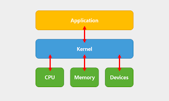

# 운영체제와 컴퓨터

# Contents

- [운영체제란](#운영체제operating-system란)
    - [컴퓨터 구조와 운영체제](#컴퓨터-구조와-운영체제)
    - [운영체제의 역할](#운영체제의-역할)
- [운영체제의 발전](#운영체제의-발전)
    - [초창기 컴퓨터](#초창기-컴퓨터)
    - [일괄 처리 시스템](#일괄-처리-시스템)
    - [대화형 시스템](#대화형-시스템)
    - [시분할 시스템](#시분할-시스템)
- 

## 운영체제(Operating system)란?

- 운용체제는 응용 프로그램의 잘못된 동작으로 컴퓨터가 망가지는 것을 막기 위해 컴퓨터 전체를 관리하고 운영하는 소프트웨어이다

### 컴퓨터 구조와 운영체제

- 컴퓨터는 하드웨어와 소프트웨어로 구성되어 있다
- 하드웨어는 컴퓨터를 구성하는 기계적인 장치이고, 소프트웨어는 하드웨어를 제어하는 명령어 집합이다
- 운영체제는 커널(kernel)과 인터페이스로 나뉜다
- 커널은 하드웨어를 직접 제어하는 운영체제의 핵심 기능들을 모아놓은 것이다
- 인터페이스는 사용자와 커널 사이의 통신을 담당한다

### 운영체제의 역할

1. 자원 관리
    - 컴퓨터 시스템의 자원을 효율적으로 관리한다
    - 자원은 CPU, 메모리, 입출력 장치 등이 있다
2. 자원 보호
    - 컴퓨터 시스템의 자원을 보호한다
    - 자원을 사용하는 응용 프로그램이 다른 응용 프로그램의 자원을 침범하지 못하도록 보호한다
3. 하드웨어 인터페이스 제공
    - 응용 프로그램이 하드웨어를 직접 제어하는 것을 막고, 운영체제를 통해 하드웨어를 제어하도록 한다
    - 응용 프로그램은 운영체제가 제공하는 인터페이스를 통해 하드웨어를 제어한다
4. 사용자 인터페이스 제공

### 운영체제의 목표

1. 효율성
    - 컴퓨터 시스템의 자원을 효율적으로 관리한다
2. 안정성
    - 컴퓨터 시스템의 자원을 보호한다
    - 응용 프로그램의 잘못된 동작으로 컴퓨터 시스템이 망가지는 것을 막는다
    - 하드웨어적인 보안 문제를 해결한다
    - 시스템에 문제가 발생했을 때 이전으로 복구하는 결함 포용 기능(fault tolerant)을 수행해야 한다
3. 확장성
    - 컴퓨터 시스템의 자원을 쉽게 추가할 수 있도록 설계한다
4. 편리성
    - 사용자가 컴퓨터 시스템을 쉽게 사용할 수 있도록 설계한다
    - 사용자가 컴퓨터 시스템을 쉽게 사용할 수 있도록 사용자 인터페이스를 제공한다

## 운영체제의 발전

- 운영체제는 컴퓨터의 발전과 함께 발전해왔다

#### 운영체제의 역사 (주변장치 기반)

|    시기     |     주요기술     |             특징              |
|:---------:|:------------:|:---------------------------:|
|  1940년대   |      없음      |       - 진공관(0과 1) 사용        |
|  1950년대   | 카드리더, 라인 프린터 | - 일괄 작업 시스템  - 운영체제의 등장 |
| 1960년대 초반 |   키보드, 모니터   |          - 대화형 시스템          |
| 1960년대 후반 |     주요기술     |             특징              |
|  1970년대   |     주요기술     |             특징              |
|  1990년대   |     주요기술     |             특징              |
|  2000년대   |     주요기술     |             특징              |

### 초창기 컴퓨터

- 최초의 컴퓨터인 에니악은 전선을 잭에 꽃아 회로를 연결하여 구성한 30톤 규모의 거대한 계산기로 미사일 탄도를 계산하기 위해 제작되었다
- 백열전구 같은 모양의 진공관을이라는 소자를 사용하여 진공관이 켜지면 1, 꺼지면 0이라고 판단했다
    - 이는 컴퓨터가 2진법을 사용하는 계기가 되었다
- 이렇게 전선을 연결하여 논리회로를 구성하는 것을 하드와이어링(hard wiring)방식 이라고 한다
- 초창기의 컴퓨터에는 운영체제가 없었다

### 일괄 처리 시스템

- 진공관을 전선으로 연결했던 초창기의 컴퓨터는 기술 발전을 거쳐 IC(Integrated Circuit)라는 칩으로 만들어졌다.
    - 이 칩은 진공관과 전선으로 만들어진 논리회로를 아주 작은 크기로 구현한 것이다
    - IC 칩을 이용함으로써 현대적인 모습의 컴퓨터가 탄생하였다
- 미약하지만 중앙처리장치인 CPU(Central Processing Unit)와 메인메모리가 있었다
    - 키보드와 같은 입력장치, 모니터와 같은 출력장치는 없었다
    - 대신 천공카드 리더(punch card reader)를 입력장치로, 라인 프린터(line printer)를 출력장치로 사용하였다
- 천공카드 시스템에서는 천공카드 리더로 하나의 작업을 읽어들여 실행하고 결과를 출력한 후 다음 작업을 읽어들여 실행한다.
    - 따라서 필요한 프로그램과 데이터를 동시에 입력해야 작업이 가능했다
    - 지금의 프로그래밍 환경과 달리 모든 작업을 한꺼번에 처리해야 하고 프로그램 실행 중간에 사용자가 데이터를 입력하거나 수정하는 것이 불가능했다
- 이러한 방식을 일괄 작업 시스템(batch job system) 또는 일괄 처리 시스템(batch processing system)이라고 한다
- 일괄 처리 시스템에서는 단순 계산 위주의 작업만 가능했다

#### 일괄 작업 시스템 입출력 장치

|      장치       |                                  설명                                  |
|:-------------:|:--------------------------------------------------------------------:|
| 천공카드 리더(입력장치) | 카드에 구멍을 뚫어 문자를 입력하는 천공카드 리더는 OMR(Optical Mark Reader)의 원조 격이라 할 수 있다 |
| 라인 프린터(출력장치)  |           문자만 출력하는 프린터로 한 번에 한 줄씩 출력하기 때문에 라인프린터라는 이름이 붙었다           |

### 대화형 시스템

- 1960년대 초반에는 키보드와 모니터가 등장하였다
    - 기존 일괄 작업 시스템은 프로그램과 데이터를 같이 입력하여 작업의 최종 결과만 얻을 수 있었다
    - 그러나 키보드와 모니터가 개발됨으로써 작업 중간에 사용자가 입력을 하거나 사용자에게 중간 결과 값을 보여줄 수 있게 되었다
- 이처럼 컴퓨터와 사용자의 대화를 통해 작업이 이루어지는 시스템을 대화형 시스템(Interactive System)이라고 한다
- 대화형 시스템이 등장하면서 문서 편집기, 게임과 같은 다양한 종류의 응용 프로그램을 만들 수 있게되었다

### 시분할 시스템

- 1960년대 후반에 컴퓨터는 크기가 작아지고 계산 능력이 향상되었다
    - 하지만 컴퓨터는 여전히 하나의 작업만 수행할 수 있어 낭비 요소가 컸다
- 이러한 인식을 바탕으로 멀티프로그래밍(multiprogramming) 기술이 개발되었다
    - 멀티프로그래밍은 하나의 CPU로 여러 작업을 동시에 실행하는 기술이다
    - 한 번에 한가지 작업만 가능한 일괄 작업 시스템에 비해 효울성이 뛰어나다

> #### 멀티프로그래밍의 동작 방식
> 멀티프로그래밍은 시간 분할 방법을 사용하여 CPU 사용 시간을 아주 잘게 쪼개어 여러 작업을 나누어 실행한다
> 
>> 1. CPU가 작업 A를 실행한다
>> 2. 작업 A가 입출력을 요청하면 CPU는 작업 A를 중단하고 입출력을 처리한다
>> 3. 입출력이 완료되면 CPU는 작업 A를 다시 실행한다
>> 4. 작업 A가 다시 입출력을 요청하면 CPU는 작업 A를 중단하고 입출력을 처리한다
>> 5. 이러한 과정을 반복한다
>
> 이처럼 여러 작업을 조금씩 처리하여 작업이 동시에 이루어지는 것처럼 보이게 하는 것을 시분할 시스템(time sharing system)이라고 한다
> 
> 시분할 시스템에서 잘게 나뉜 시간 한 조각을 타임 슬라이스(time slice)또는 타임 퀀텀(time quantum)이라고 한다
> 
> **오늘날의 컴퓨터에서는 대부분 시분할 시스템이 사용된다**

