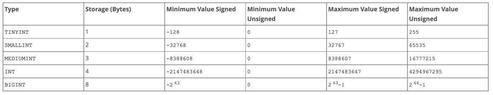

# MySQL

## 문자열 Split 하기

- MYSQL에서는 SPLIT 함수가 없다
- SUBSTRING_INDEX 함수를 사용해서 SPLIT 기능을 구현할 수 있다
- 문자열을 시작 or 끝부터 index번째 구분자까지 자르는 것입니다.

| Data        |
|-------------|
| a@gmail.com |
| b@naver.com |
| 1-2-3-4     |

```sql
SUBSTRING_INDEX('a@gmail.com', '@', 1)
// a

SUBSTRING_INDEX('b@naver.com', '@', -1)
// naver.com 

SUBSTRING_INDEX('1-2-3-4', '-', 1)
// 1

SUBSTRING_INDEX('1-2-3-4', '-', 3)
// 1-2-3

SUBSTRING_INDEX('1-2-3-4', '-', -1)
// 4

SUBSTRING_INDEX('1-2-3-4', '-', -3)
// 2-3-4

SUBSTRING_INDEX(SUBSTRING_INDEX('1-2-3-4', '-', -3), '-', 1)
// 2
```

## Trigger

- 트리거(Trigger)란 특정 조건이 만족하면 저절로 실행되는 일종의 장치라고 볼 수 있다.
- 이녀석은 프로시저(Procedure)나 펑션(function)과 다르게 한번 설정을 하면 동작을 항상 감시하고 있다가
  조건에 해당하는 동작이 수행되는 순간 실행되는 특징을 가지고 있다.

### 구조

```sql
DELIMITER $$
	CREATE TRIGGER trigger_name
	{ BEFORE | AFTER } { INSERT | UPDATE| DELETE }
	ON table_name FOR EACH ROW
	BEGIN
		-- 트리거 내용
	END
DELIMITER ;
```

### 이벤트 속성

트리거 작동 시점

- After : 이벤트(조건 명령문) 발생 이후 트리거 실행
- before: 이벤트(조건 명령문) 발생 이전 트리거 실행

이벤트(조건 명령문)

- Delete : 삭제 했을 때 트리거 실행
- Insert : 삽입 했을 때 트리거 실행
- Update : 삭제 했을 때 트리거 실행

### 키워드

1. old
    - 예전 데이터 즉, delete 로 삭제 된 데이터 또는 update 로 바뀌기 전의 데이터
2. new
    - 새 데이터 즉, insert 로 삽입된 데이터 또는 update 로 바뀐 후의 데이터

표로 정리하면 다음과 같다.

| 이벤트    | old | new |
|--------|-----|-----|
| delete | O   | X   |
| insert | X   | O   |
| update | O   | O   |

사용 가능: O

사용 불가능: X


## 정수 타입


## CAST
- 데이터 형변환시 사용

```sql
사용법
CAST({value} AS {type});
```
- type
  1. BINARY[(N)]
  2. CHAR[(N)] [charset_info]
  3. DATE
  4. DATETIME
  5. DECIMAL[(M[,D])]
  6. JSON
  7. NCHAR[(N)]
  8. SIGNED [INTEGER]
  9. TIME
  10. UNSIGNED [INTEGER]
  11. 등등...


### 예제
```sql
SELECT NOW();

> 2022-11-25 16:16:50
    
    
    
SELECT CAST(NOW() AS UNSIGNED);

> 20221125161629
```

## 날짜 함수


