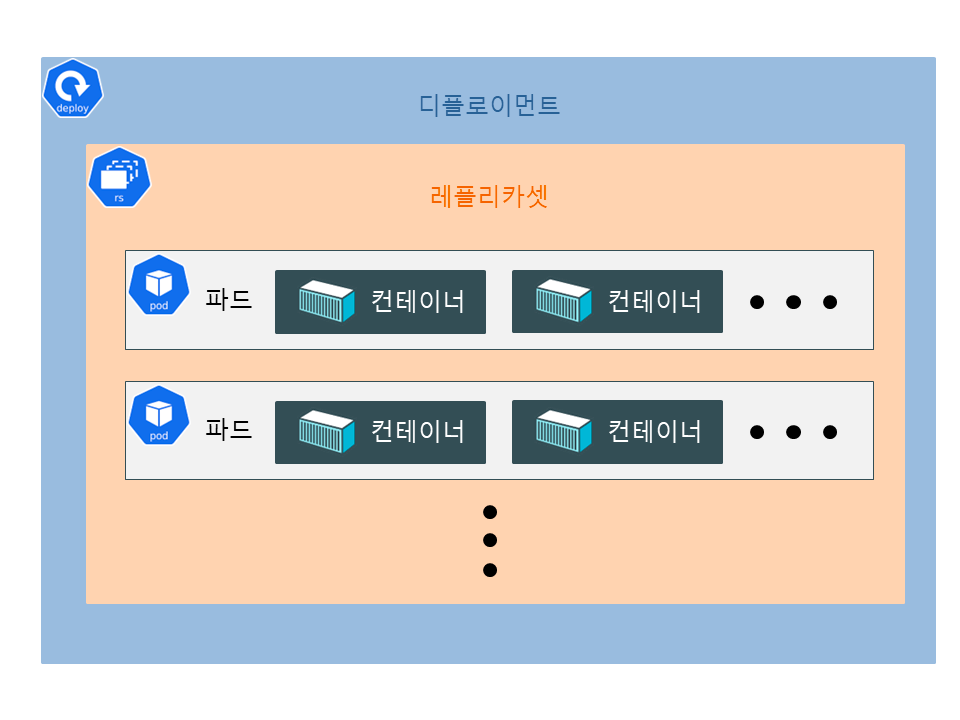

# [Kubernetes](https://kubernetes.io/)

## Kubernetes란
- 다수의 컨테이너를 관리하고 확장, 자동화하는 오픈소스 플랫폼
- 2014년 구글에서 공개하였고 현재 생태계가 빠르게 성장하고 있음
- k와 s사이에 8글자가 있다고 해서 k8s라고 표기하기도 함

## 구성
- deployment
  - pod를 실행할 때 사용하는 리소스
  - 상태가 없는 배포 단위이며 replicaset을 포함하고 있음
- replicaset
  - 파드를 몇개 생성(복제)하여 유지할지 결정하는 리소스
- pod
  - 컨테이너를 생성하는 리소스
  - pod안에는 여러 개의 컨테이너가 들어갈 수도 있음
- service
  - kubernetes cluster 내부에 있는 pod 등의 object 를 kubernetes network 나 외부에 노출시킬 때 사용하는 resource

> ### resource 와 object
> kubernetes 에는 resource 와 object 라는 개념이 있다
> 
> 프로그래밍 언어로 비유하면 resource 는 class, object 는 instance 와 흡사하다

## manifest
- apiVersion
  - 현재 리소스의 API 버전
  - 이 버전은 시간이 지남에 따라 계속 변경됨
- kind
  - 현재 리소스의 종류를 지정함
- metadata
  - 현재 object 의 이름과 각종 설정 정보
  - name
    - deployment 의 이름을 지정
- spec
  - 현재 object 의 원하는 상태를 정의하는 부분
  - replicas
    - replicaset에서 pod를 몇 개 유지할지 설정함 
  - selector
    - deployment가 관리할 pod를 찾는 방법을 정의 함
  - template
    - pod 설정
    - metadata
      - labels에 키-값을 설정하여 deployment가 찾을 수 있도록 함
    - spec
      - pod의 spec
      - pod에는 컨테이너가 여러 개 들어갈 수 있어 containers로 되어있고, 그 아래에는 `-`를 사용하여 배열로 값을 설정
        - containers
          - name
            - 컨테이너의 이름을 설정
          - image
            - 컨테이너를 실행할 Docker 이미지를 `<image>:<tag>` 형식으로 설정 
          - ports
            - 배열 형태로 containerPort를 설정
            - containerPort
              - 컨테이너에서 개방할 포트 번호를 뜻함

